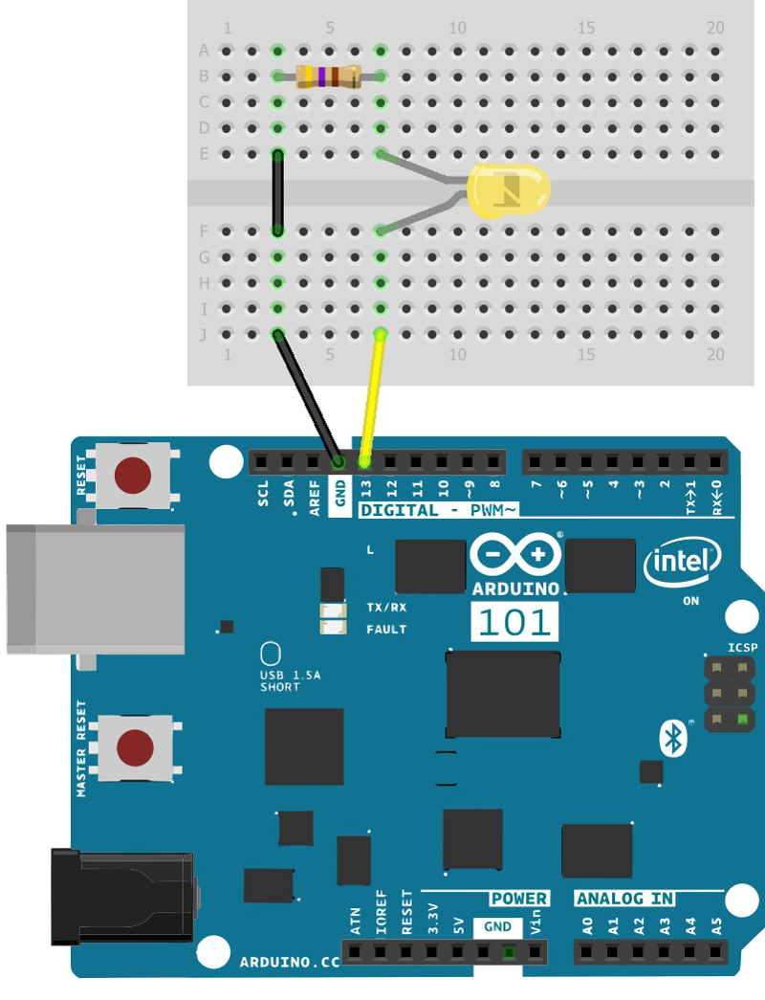
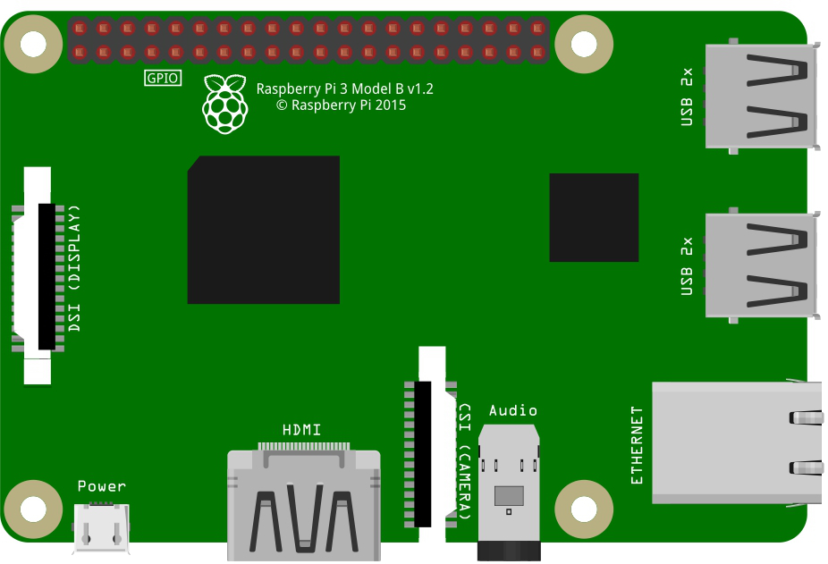
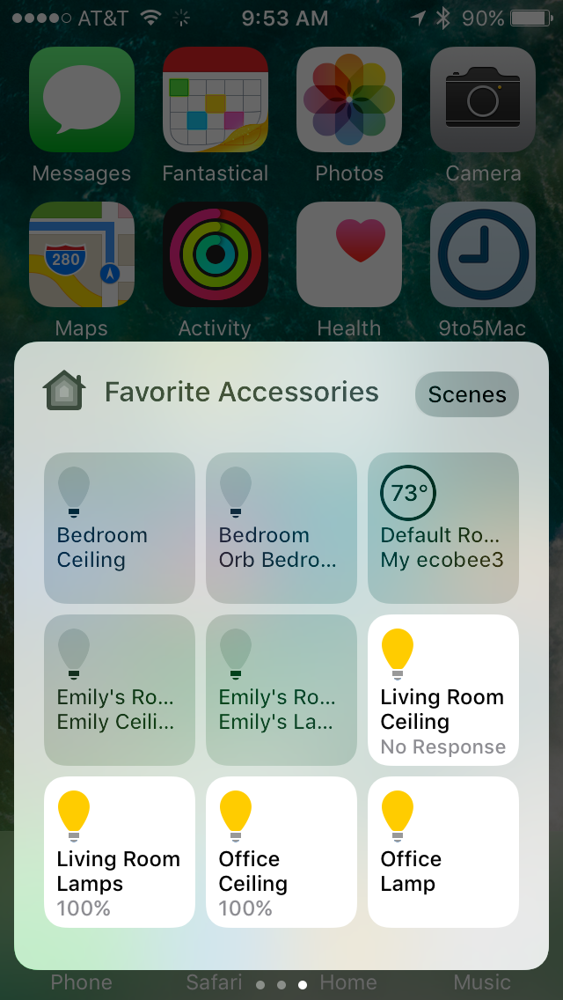

# Raspberry Pi 3 and Arduino 101 LED on Pin 13


Turn the Arduino built-in LED connected to pin 13 into a wireless HomeKit light. Use the Home app or Siri on your Apple device to switch it on and change brightness.

## Arduino 101

Creating a BLE peripheral out of an Arduino 101 is straightforward and simple. The Curie SoC core has a built-in BLE adapter. If Arduino 101 is new for you, [this link](https://www.arduino.cc/en/Guide/Arduino101) is a good place where to start.

### Wiring
There's no wiring needed, but if you'd like a more bright LED, you can connect it to pin 13. A series resistor has to be added to limit the current passing through below 20 mA. Anything between 100 Ohms and 1k Ohms will do.




### Running the Sketch
Compile, run and upload the [sketch](arduino-led-13.ino) using [Arduino IDE](https://www.arduino.cc/en/Main/Software). The sketch creates a BLE service with a couple of readable, writable and notifiable characteristic. There's one characteristic for on/off state, brightness, hue and saturation. Once the Raspberry is setup, it connects to the service and exposes it as a HomeKit lightbulb.

Leave the Arduino powered on and the sketch running while you setup the Raspberry. The sketch has some built-in logging, so keeping the Serial monitor open may be helpful for debugging.

**Note** _Alternatively, you can use any of the many BLE boards available on the market ([RFDuino](http://www.rfduino.com/), [Bluefruit Micro](https://www.adafruit.com/product/2661), ...) as long as you keep UUIDs of the services and characteristics in sync with your `config.json` file, everything will still work. However, keep in mind that the sketch may need some modifications to compile and run on other boards._


## Raspberry Pi 3

For help installing an operating system on your new Pi, the official documentation contains a couple of [nice videos](https://www.raspberrypi.org/help/videos/).

### Wiring
No wiring except for the micro-USB cable providing power is needed.




The Pi also needs to be connected to the same router (subnet) as the Apple device you plan to use. It doesn't matter whether via Wifi or Ethernet. Otherwise, you won't be able discover and connect to Homebridge server running on the Pi.

### Running Homebridge
Running Homebridge on a Raspberry Pi is straightforward. Follow [this guide](https://github.com/nfarina/homebridge/wiki/Running-HomeBridge-on-a-Raspberry-Pi) to install Homebridge server and then run the following command to install the homebridge-bluetooth plugin:

```bash
[sudo] npm install -g homebridge-bluetooth
```

Edit the `~/.homebridge/config.json`, name your Homebridge server and add a new accessory to allow the plugin to connect to the BLE service running on the Arduino:

```json
{
    "bridge": {
        "name": "Raspberry Pi 3",
        "username": "CC:22:3D:E3:CE:30",
        "port": 51826,
        "pin": "031-45-154"
    },

    "description": "Raspberry Pi 3 HomeKit Bridge",

    "accessories": [
        {
            "accessory": "Bluetooth Low Energy",
            "name": "Arduino 101",
            "address": "01:23:45:67:89:ab",
            "led_service": "19B10010-E8F2-537E-4F6C-D104768A1214",
            "led_characteristic": "19B10011-E8F2-537E-4F6C-D104768A1214",
        }
    ]
}
```

Finally, start the Homebridge server. If you use Linux you may need to run with higher privileges in order to have access to the BLE hardware layer. See [this link](https://github.com/sandeepmistry/noble#running-without-rootsudo) for more details about running with `sudo`.

```
[sudo] homebridge
```

**Note** _Homebridge server doesn't run only on Linux. MacOS and Windows machines are also supported given they have a built-in BLE adapter or an USB dongle. For more details see supported platforms of [Homebridge](https://github.com/nfarina/homebridge) and [Noble](https://github.com/sandeepmistry/noble)._

**Note** _Alternatively, you can use a Raspberry Pi 2 with a supported USB BLE dongle instead of the Pi 3._


## Apple Device

### Pairing
Open Home app and tap the '+' button to add new accessory. When you attempt to add the 'Raspberry Pi 3' bridge, it will ask for a "PIN" from the `config.json` file. Default is `031-45-154`. Once you are paired with your new Rapsberry Homebridge server all the Arduino accesory can be added the same way as the bridge.

### Interacting
Once Arduino has been added to HomeKit database, besides using the Home app or Control Center at the bottom of the screen, you should be able to tell Siri to control any HomeKit accessory. Try 'Siri, Turn on Arduino.'. However, Siri is a cloud service and iOS may need some time to synchronize your HomeKit database to iCloud.



