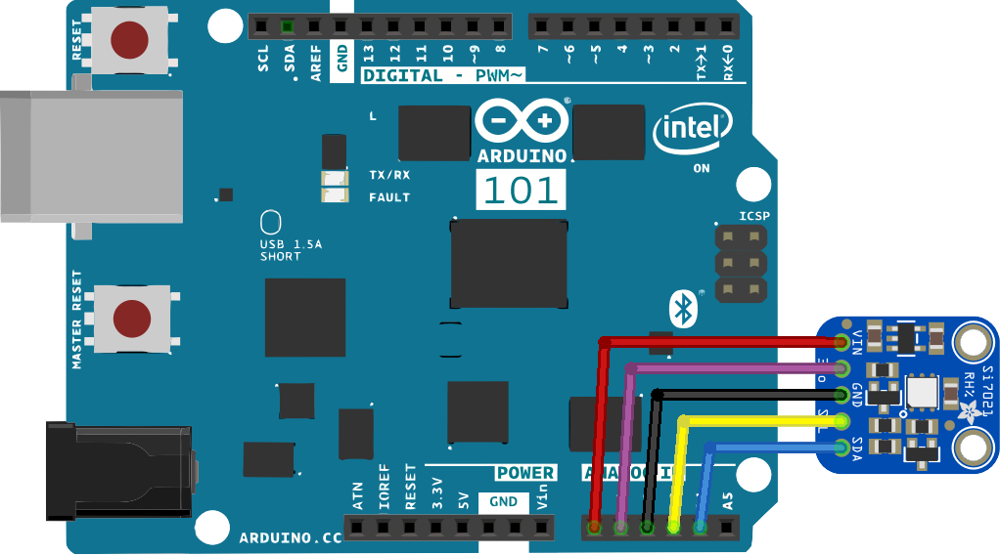
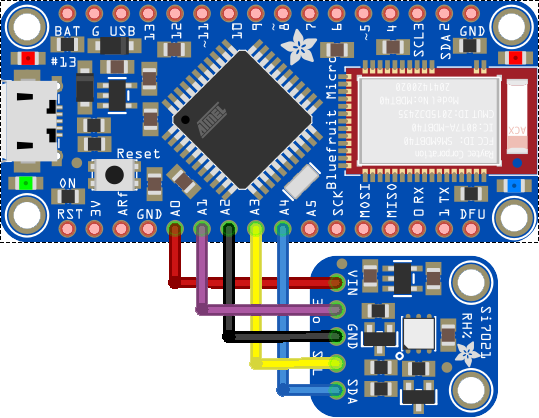
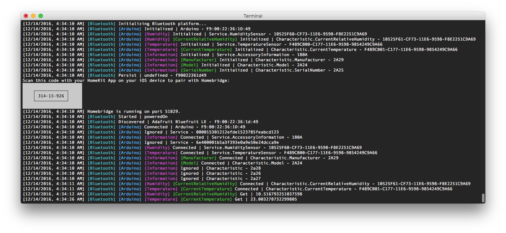
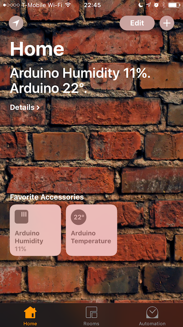
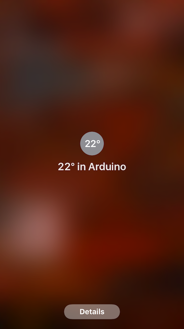
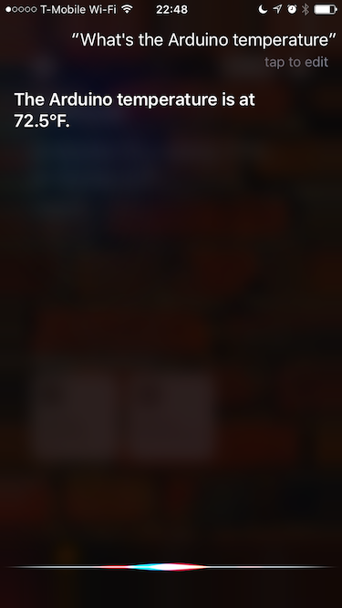
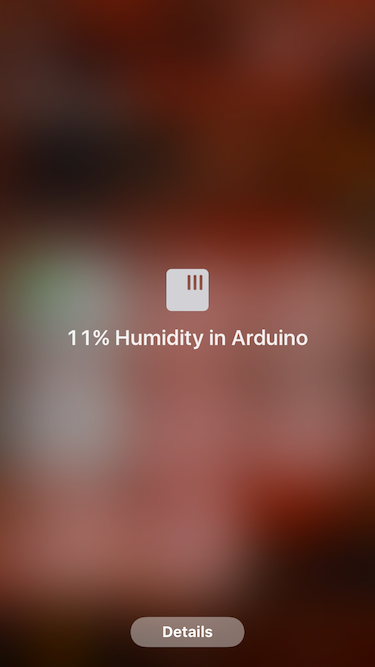

# Humidity and Temperature Sensor


Turn a BLE capable microprocessor and the [Si7021](https://www.silabs.com/Support%20Documents/TechnicalDocs/Si7021-A20.pdf) humidity and temperature sensor into a wireless HomeKit weather station. Temperature and Humidity readings can be displayed in the Home app on your Apple device and used to setup automation rules for your thermostat and humidifier.


This example uses [Arduino 101](https://www.arduino.cc/en/Main/ArduinoBoard101) or [Bluefruit Micro LE](https://www.adafruit.com/products/2661) and [Raspberry Pi 3](https://www.raspberrypi.org/). Generally, any programmable BLE peripheral and a box capable of running [Node.js](https://nodejs.org) with [Noble](https://github.com/sandeepmistry/noble) will work. You'll also need the Si7021 humidity and temperature sensor. There is a nice breakout done by [Adafruit](https://www.adafruit.com/products/3251) and you can also use another breakout done by [Sparkfun](https://www.sparkfun.com/products/13763).


## BLE Periphral (Arduino 101, Bluefruit Micro LE or Other BLE Board)

Download and install the latest version of the [Arduino IDE](https://www.arduino.cc/en/Main/Software). If you're totally new to microcontrollers take some time to go through an introductory tutorial and learn how to make a LED blink. This will help you to understand how to use the IDE, how to upload a sketch and what is the code actually doing.

### Wiring
The Si7021 breakout is wired to ports `A0`-`A4`. `A0` and `A2` are set as outputs `HIGH`/`LOW` and serve as `VCC` and `GND` to provide power to the sensor. Ports `A3` and `A4` serve as two wire interface data `SDA` and clock `SCL` lines. `A3` is connected to optional `3VO` outptu of the voltage regulator built into the Adafruit's breakout and is not used at all. This pin setup was chosen so the breakout can be soldered directly onto the Bluefruit board to create a small and compact package.





**Note** _Alternatively, you can use any of the many BLE boards available on the market ([BlueBean](https://punchthrough.com/bean/), [RedBearLabs BLE Nano](http://redbearlab.com/blenano), ...) as long as you keep UUIDs of the services and characteristics in sync with your `config.json` file, everything will work just fine._

### Running the Sketch
Compile, run and upload the [arduino101.ino](arduino101/arduino101.ino) or [bluefruit.ino](bluefruit/bluefruit.ino) sketch using the [Arduino IDE](https://www.arduino.cc/en/Main/Software). The sketch creates two BLE services with a readable and notifiable characteristic for the current temperature and humidity. Both values are a `float` type.

```cpp
BLEService humidityService("10525F60-CF73-11E6-9598-F8E2251C9A69");
BLEFloatCharacteristic humidityCharacteristic("10525F61-CF73-11E6-9598-F8E2251C9A69", BLERead | BLENotify);
BLEService thermometerService("F489CB00-C177-11E6-9598-9854249C9A66");
BLEFloatCharacteristic temperatureCharacteristic("F489CB01-C177-11E6-9598-9854249C9A66", BLERead | BLENotify);

```

Take a look into [this file](https://github.com/KhaosT/HAP-NodeJS/blob/master/lib/gen/HomeKitTypes.js#L1147) to see the full definition of the _CurrentRelativeHumidity_ characteristic used in the _HumiditySensor_ service. _TemperatureSensor_ service has _CurrentTemperature_ characteristic. Once the BLE central device is setup, it connects to these characteristics and exposes them via Homebridge as a HomeKit accessory of type _HumiditySensor_ and _TemperatureSensor_.

The code also calculates (pseudo-moving) average to prevent noise in the measurements to trigger frequent mew value notifications. Duration of the averaging window is about 30 s. Once the moving average accumulates change above a certain threshold a new value of the characteristic is set which triggers the notify mechanism and propagates the measurement to HomeKit. The threshold is approximately half of the sensor accuracy (±0.4°C and ±3%).

Leave the device powered on and the sketch running while you setup the Homebridge server. The sketch has some built-in logging, so keeping the Serial monitor open may be helpful for debugging.


## BLE Central & Homebridge Server (Raspberry Pi 3 or Other Compatible Box)

For help installing an operating system on your new Pi, the official documentation contains a couple of [nice videos](https://www.raspberrypi.org/help/videos/).

### Wiring
No wiring except for the micro-USB cable providing power is needed. The Pi needs to be connected to the same router (subnet) as the Apple device you plan to use. It doesn't matter whether via Wifi or Ethernet. Otherwise, you won't be able discover and connect to the Homebridge server running on the Pi.


**Note** _Alternatively, you can use a Raspberry Pi 2 with a supported USB BLE dongle instead of the Pi 3._

### Running Homebridge
Running Homebridge on a Raspberry Pi is straightforward. Follow [this guide](https://github.com/nfarina/homebridge/wiki/Running-HomeBridge-on-a-Raspberry-Pi) to install Homebridge server and then run the following command to install the homebridge-bluetooth plugin:

```sh
[sudo] npm install -g homebridge-bluetooth
```

Edit the `~/.homebridge/config.json`, name your Homebridge server and add a new accessory to allow the plugin to connect to the BLE service running on the Arduino:

```js
"name": "Arduino",
"address": "01:23:45:67:89:AB",
"services": [
  {
    "name": "Humidity Sensor",
    "type": "HumiditySensor",
    "UUID": "10525F60-CF73-11E6-9598-F8E2251C9A69",
    "characteristics": [
      {
        "type": "CurrentRelativeHumidity",
        "UUID": "10525F61-CF73-11E6-9598-F8E2251C9A69"
      }
    ]
  },
  {
    "name": "Temperature Sensor",
    "type": "TemperatureSensor",
    "UUID": "F489CB00-C177-11E6-9598-9854249C9A66",
    "characteristics": [
      {
        "type": "CurrentTemperature",
        "UUID": "F489CB01-C177-11E6-9598-9854249C9A66"
      }
    ]
  }
]
```

Finally, start the Homebridge server. If you use Linux you may need to run with higher privileges in order to have access to the BLE hardware layer. See [this link](https://github.com/sandeepmistry/noble#running-without-rootsudo) for more details about running without `sudo`.

```sh
[sudo] homebridge
```



**Note** _Homebridge server doesn't run only on Linux. MacOS and Windows machines are also supported given they have a built-in BLE adapter or an USB dongle. For more details see supported platforms of [Homebridge](https://github.com/nfarina/homebridge) and [Noble](https://github.com/sandeepmistry/noble)._


## Apple Device (iOS 10 or newer)

### Pairing
Open Home app and tap the '+' button to add new accessory. When you attempt to add the 'Raspberry Pi 3' bridge, it will ask for a "PIN" from the `config.json` file. Once you are paired with your new Rapsberry, Homebridge server all the connected BLE accesories can be added the same way as the bridge.

### Interacting
Once your BLE accessory has been added to HomeKit database, besides using the Home app or Control Center at the bottom of the screen, you should be able to tell Siri to get the reading from any HomeKit accessory. Try _"Hey Siri, what's the humidity of the Arduino?"_. However, Siri is a cloud service and iOS may need some time to synchronize your HomeKit database to iCloud.







