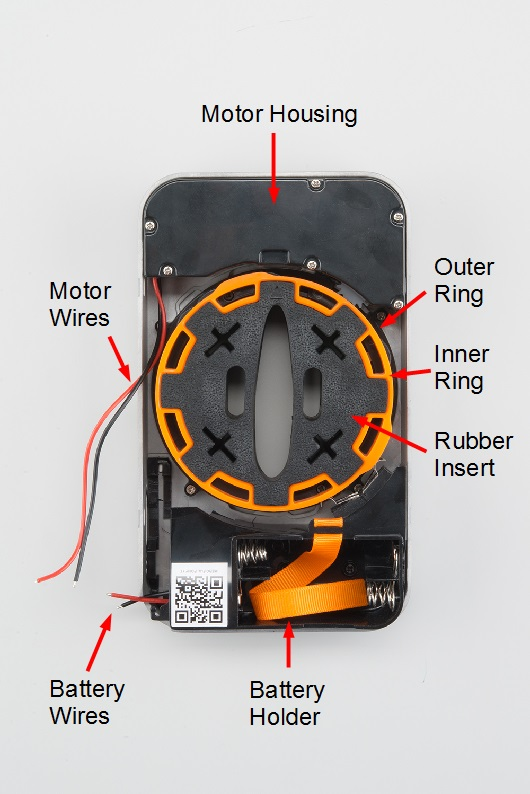
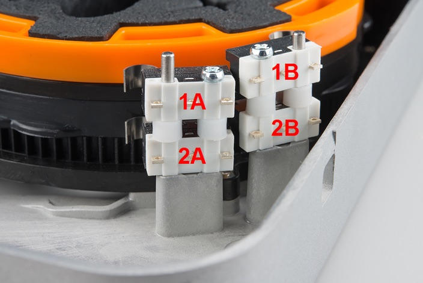
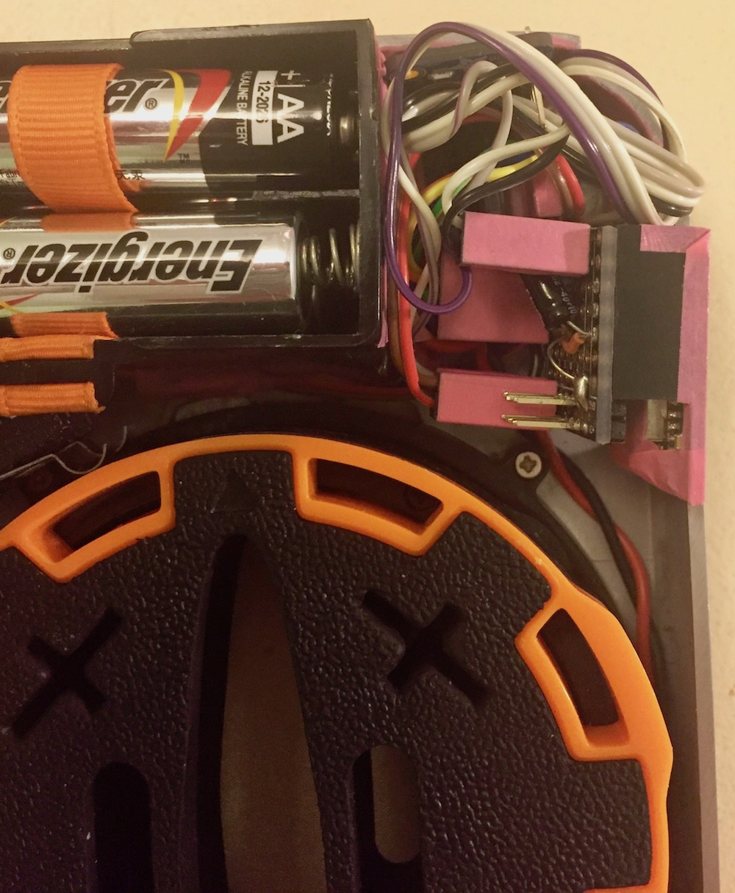
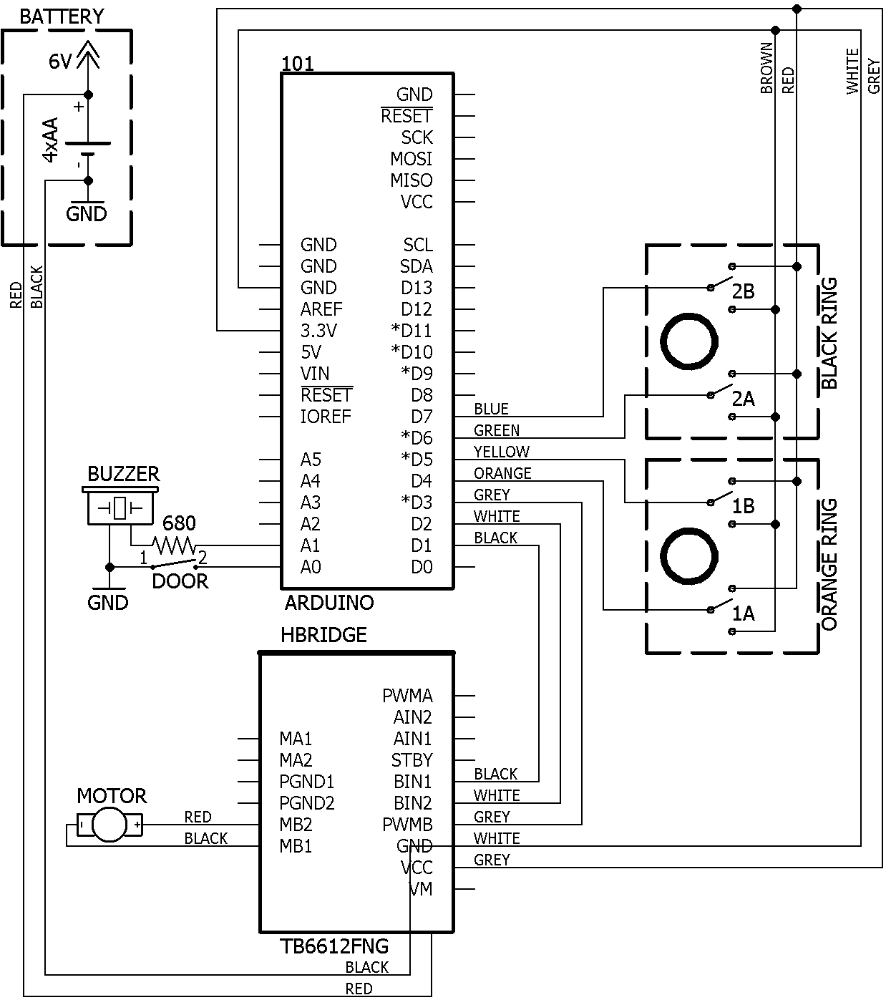
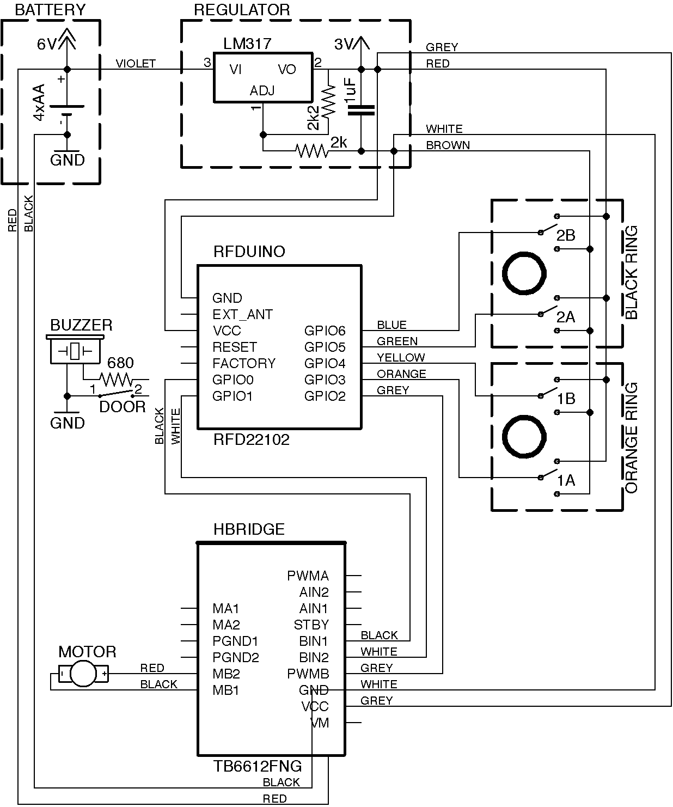
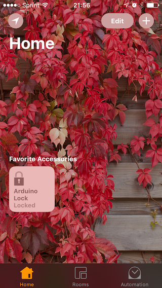
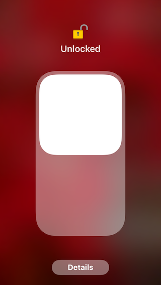
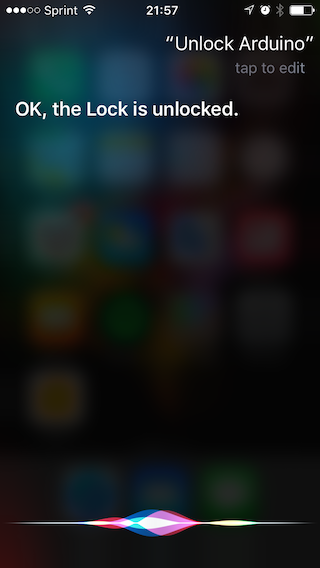

# Lock


Turn an old _Lockitron V1_ body connected to a BLE capable microprocessor into a wireless HomeKit lock. Use the Home app or Siri on your Apple device to secure and unsecure the lock.


This example uses [Arduino 101](https://www.arduino.cc/en/Main/ArduinoBoard101) or [RFduino](http://www.rfduino.com/) and [Raspberry Pi 3](https://www.raspberrypi.org/). Generally, any programmable BLE peripheral and a box capable of running [Node.js](https://nodejs.org) with [Noble](https://github.com/sandeepmistry/noble) will work. You'll also need a [H-Bridge breakout](https://www.adafruit.com/product/2448) to power the motor and an old _Lockitron V1_ body . It's sold by [Sparkfun](https://www.sparkfun.com/products/retired/13648), [Adafruit](https://www.adafruit.com/products/2579) or [eBay](http://www.ebay.com/sch/i.html?_from=R40&_trksid=p2050601.m570.l1313.TR12.TRC2.A0.H0.Xlockitron.TRS0&_nkw=lockitron&_sacat=0) :).


## Lock Mechanism

### Installation

Here's the official [Installation Manual](https://cdn.sparkfun.com/datasheets/Components/General/installation_manual_lockitron.pdf). Or if you preffer here's the [Installation Video](https://www.youtube.com/watch?v=ZOJhfsSCoYs).

[](https://www.youtube.com/watch?v=ZOJhfsSCoYs)

### Wiring

Here's how the lock looks inside, when you take off the black cover. The lock uses tactile switch sensors to detect position of the orange and black rings. Sparkfun has a nice article about the hookup [here](https://learn.sparkfun.com/tutorials/lockitron-hardware-hookup-guide?_ga=1.268388430.1924023418.1474989120). I've borrowed some pics from them. Generally, you want to solder wire to each sensor and possibly to extend the battery and motor wires to reach outside of the case.


&nbsp;&nbsp;&nbsp;&nbsp;&nbsp;


If you use _RFDuino_ and want to power the whole thing from the batteries, you'll want add a voltage regulator. Theoretically, you could add another wire to the battery pack and just use the voltage of two AA batteries, but the motor is quite hungry and eats about 2 A when running. The voltage of the two batteries drop below 1.9 V and the poor _RFduino_ resets. This doesn't happen with the regulator.

I've managed to put the voltage regulator on the [proto shield](http://www.rfduino.com/product/rfd22125-proto-shield-for-rfduino/index.html). If you cut and throw away some plastics, it's possible to squeeze the _RFDuino_ inside of the original case.




## BLE Accessory (Arduino 101, RFDuino or Other BLE Board)

Download and install the latest version of the [Arduino IDE](https://www.arduino.cc/en/Main/Software). If you're totally new to microcontrollers take some time to go through an introductory tutorial and learn how to make a LED blink. This will help you to understand how to use the IDE, how to upload a sketch and what is the code actually doing.

### Wiring

Connect your board to the H-Bridge breakout, voltage regulator and lock according the the following schematics. This may, again, require some soldering.


&nbsp;&nbsp;&nbsp;&nbsp;&nbsp;


**Note** _Alternatively, you can use any of the many BLE boards available on the market ([BlueBean](https://punchthrough.com/bean/), [RedBearLabs BLE Nano](http://redbearlab.com/blenano), ...) as long as you keep UUIDs of the services and characteristics in sync with your `config.json` file, everything will work just fine._


### Running the Sketch
Compile, run and upload the [arduino101.ino](arduino101/arduino101.ino) or [rfduino.ino](rfduino/rfduino.ino) sketch using the [Arduino IDE](https://www.arduino.cc/en/Main/Software).
The sketch creates a BLE service with 2 characteristics. There's one characteristic for the lock target state (`Unsecured/Secured`) and the other for the lock current state (`Unsecured/Secured/Jammed/Unknown`). Only the target characteristic is writeable ans is used to trigger the locking mechanism.

```cpp
BLEService lockMechanismService("43AAF900-5FF0-4633-95A2-FE4189EE103B");
BLEUnsignedCharCharacteristic targetStateCharacteristic("43AAF901-5FF0-4633-95A2-FE4189EE103B",
                                                        BLEWrite | BLERead | BLENotify);
BLEUnsignedCharCharacteristic currentStateCharacteristic("43AAF902-5FF0-4633-95A2-FE4189EE103B",
                                                         BLERead | BLENotify);
```

When the tactile switch is toggled the LEDs turn on (or turn off if they were on) and the BLE subscribe-notification mechanism cases the an update update on the Homebridge. This way the information about switching propagates through callbacks to the Apple device without any polling.

Take a look into [this file](https://github.com/KhaosT/HAP-NodeJS/blob/master/lib/gen/HomeKitTypes.js#L2896) to see the full definition of the _LockMechanism_ service.

Once the BLE central device is setup, it connects to this characteristic and exposes it via Homebridge as a HomeKit accessory of type _LockMechanism_. The sketch also contains some logic to handle jamming and other corner cases.

Leave the device powered on and the sketch running while you setup the Homebridge server. The sketch has some built-in logging, so keeping the Serial monitor open may be helpful for debugging.


## BLE Central & Homebridge Server (Raspberry Pi 3 or Other Compatible Box)

For help installing an operating system on your new Pi, the official documentation contains a couple of [nice videos](https://www.raspberrypi.org/help/videos/).

### Wiring
No wiring except for the micro-USB cable providing power is needed. The Pi needs to be connected to the same router (subnet) as the Apple device you plan to use. It doesn't matter whether via Wifi or Ethernet. Otherwise, you won't be able discover and connect to the Homebridge server running on the Pi.


**Note** _Alternatively, you can use a Raspberry Pi 2 with a supported USB BLE dongle instead of the Pi 3._

### Running Homebridge
Running Homebridge on a Raspberry Pi is straightforward. Follow [this guide](https://github.com/nfarina/homebridge/wiki/Running-HomeBridge-on-a-Raspberry-Pi) to install Homebridge server and then run the following command to install the homebridge-bluetooth plugin:

```sh
[sudo] npm install -g homebridge-bluetooth
```

Edit the `~/.homebridge/config.json`, name your Homebridge server and add a new accessory to allow the plugin to connect to the BLE service running on the Arduino:

```js
"name": "Arduino",
"address": "01:23:45:67:89:AB",
"services": [ {
    "name": "Lock",
    "type": "LockMechanism",
    "UUID": "43AAF900-5FF0-4633-95A2-FE4189EE103B",
    "characteristics": [ {
        "type": "LockTargetState",
        "UUID": "43AAF901-5FF0-4633-95A2-FE4189EE103B"
      }, {
        "type": "LockCurrentState",
        "UUID": "43AAF902-5FF0-4633-95A2-FE4189EE103B"
      } ]
   } ]
```

Finally, start the Homebridge server. If you use Linux you may need to run with higher privileges in order to have access to the BLE hardware layer. See [this link](https://github.com/sandeepmistry/noble#running-without-rootsudo) for more details about running without `sudo`.

```
[sudo] homebridge -D
```

**Note** _Running with `-D` turns on additional debugging output that is very helpful for getting addresses and UUIDs of your BLE devices that needs to match with the `config.json` file._


**Note** _Homebridge server doesn't run only on Linux. MacOS and Windows machines are also supported given they have a built-in BLE adapter or an USB dongle. For more details see supported platforms of [Homebridge](https://github.com/nfarina/homebridge) and [Noble](https://github.com/sandeepmistry/noble)._


## Apple Device

### Pairing
Open Home app and tap the '+' button to add new accessory. When you attempt to add the 'Raspberry Pi 3' bridge, it will ask for a "PIN" from the `config.json` file. Once you are paired with your new Rapsberry Homebridge server all the Arduino accesories are added at the same time as the bridge.

### Interacting
Once your BLE accessory has been added to HomeKit database, besides using the Home app or Control Center at the bottom of the screen, you should be able to tell Siri to control any HomeKit accessory. Try _"Hey Siri, lock the Arduino"_. However, Siri is a cloud service and iOS may need some time to synchronize your HomeKit database to iCloud.




