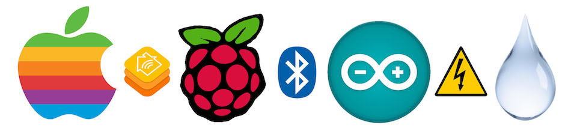
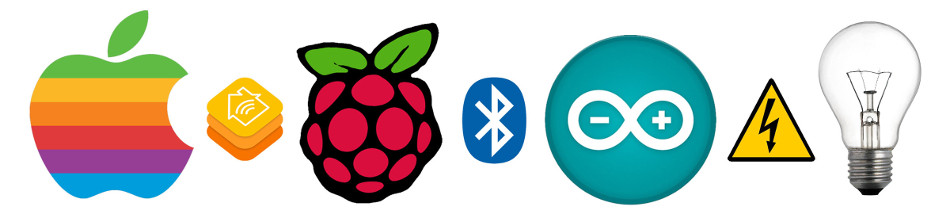
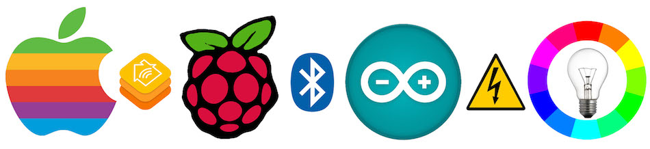
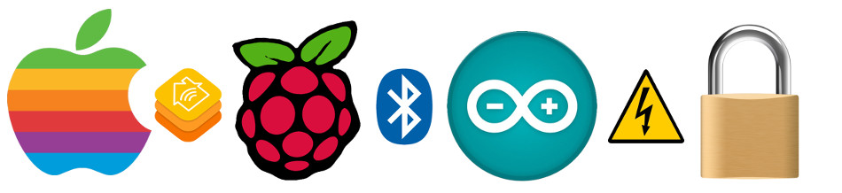
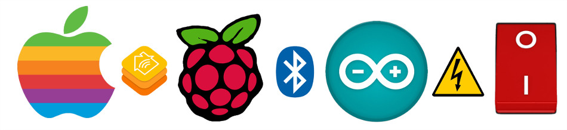

# Examples

Here's couple of example how to use this plugin. Each example also contains sketches/code for selected BLE enabled microcontrollers.

## Humidity and Temperature Sensor [`humidity/`](humidity)

Turn a BLE capable microprocessor and a Si7021 humidity and temperature sensor into a wireless HomeKit weather station. Humidity and temperature reading can be displayed in the Home app on your Apple device and used to setup your home automation rules.

## Lightbulb [`lightbulb/`](lightbulb)

Turn an LED connected to a BLE capable microprocessor into a wireless HomeKit lightbulb. Use the Home app or Siri on your Apple device to switch it on and off.

## Lightbulb RGB [`lightbulb-rgb/`](lightbulb-rgb)

Turn three LEDs connected to a BLE capable microprocessor into a wireless HomeKit lightbulb. Use the Home app or Siri on your Apple device to switch it on and change it's brightness or color. BLE subscribe capability allows the microprocessor to sent events back to the HomeKit whenever an external event changes the state of the light.

## Lock [`lock/`](lock)

Turn an old Lockitron V1 body connected to a BLE capable microprocessor into a wireless HomeKit lock. Use the Home app or Siri on your Apple device to secure and unsecure the lock.

## Switch [`switch/`](switch)

Turn a tactile push button connected to a BLE capable microprocessor into a wireless HomeKit switch. Use the Home app or Siri on your Apple device to trigger events based on the switch state.

## Thermometer [`thermometer/`](thermometer)

Turn a BLE capable microprocessor into a wireless HomeKit thermometer. Temperature reading can be displayed in the Home app on your Apple device.
