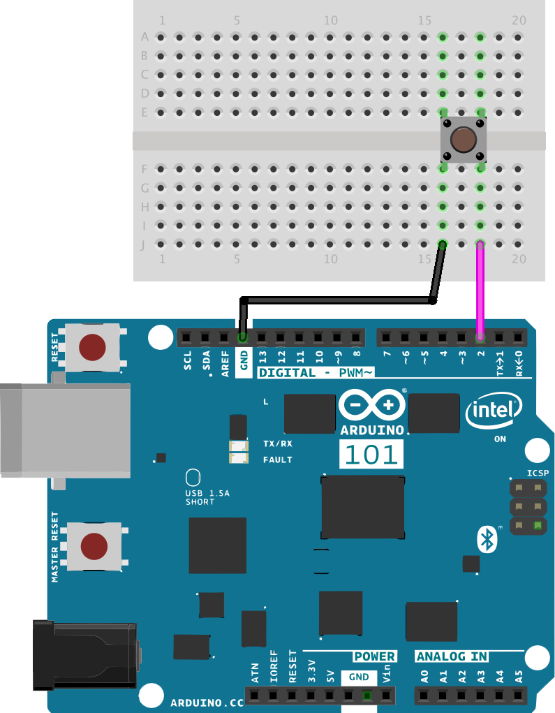
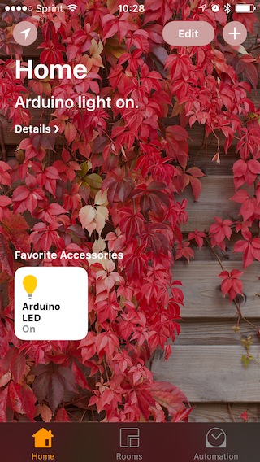
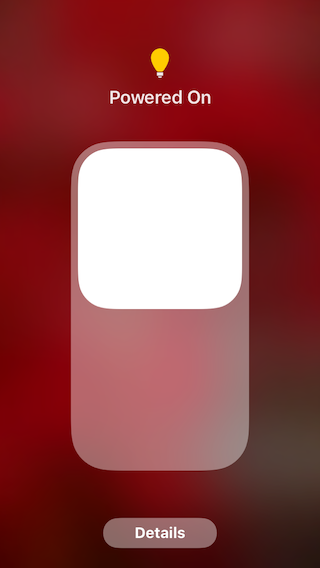

# Switch Accessory


Turn a tactile push button connected to a BLE capable microprocessor into a wireless HomeKit switch. Use the Home app or Siri on your Apple device to trigger events based on the switch state.


This example uses [Arduino 101](https://www.arduino.cc/en/Main/ArduinoBoard101) and [Raspberry Pi 3](https://www.raspberrypi.org/). Generally, any programmable BLE peripheral and a box capable of running [Node.js](https://nodejs.org) with [Noble](https://github.com/sandeepmistry/noble) will work.


## BLE Accessory (Arduino 101 or Other BLE Board)

Download and install the latest version of the [Arduino IDE](https://www.arduino.cc/en/Main/Software). If you're totally new to microcontrollers take some time to go through an introductory tutorial and learn how to make a LED blink. This will help you to understand how to use the IDE, how to upload a sketch and what is the code actually doing.

### Wiring
Connect the tactile switch to pin 2 and ground. When the button is pushed it connects the pin to the ground. The sketch code activates the internal 10k Ohm pull-up resitor to keep the pin high when the switch isn't pressed.



**Note** _Alternatively, you can use any of the many BLE boards available on the market ([BlueBean](https://punchthrough.com/bean/), [RedBearLabs BLE Nano](http://redbearlab.com/blenano), ...) as long as you keep UUIDs of the services and characteristics in sync with your `config.json` file, everything will work just fine._

### Running the Sketch
Compile, run and upload the [arduino101.ino sketch](arduino101/arduino101.ino) using the [Arduino IDE](https://www.arduino.cc/en/Main/Software). The sketch creates a BLE service with a readable, writable and notifiable characteristic for on/off state.

```cpp
BLEService switchService("5ECEC5A0-7F71-41DA-9B8C-6252FE7EFB7E");
BLECharCharacteristic onCharacteristic("5ECEC5A1-7F71-41DA-9B8C-6252FE7EFB7E", BLEWrite | BLERead | BLENotify);
```

Take a look into [this file](https://github.com/KhaosT/HAP-NodeJS/blob/master/lib/gen/HomeKitTypes.js#L1147) to see the full definition of the _On_ characteristic used in the _Switch_ service. Once the BLE central device is setup, it connects to this characteristic and exposes it via Homebridge as a HomeKit accessory of type _Switch_.

Leave the device powered on and the sketch running while you setup the Homebridge server. The sketch has some built-in logging, so keeping the Serial monitor open may be helpful for debugging.


## BLE Central & Homebridge Server (Raspberry Pi 3 or Other Compatible Box)

For help installing an operating system on your new Pi, the official documentation contains a couple of [nice videos](https://www.raspberrypi.org/help/videos/).

### Wiring
No wiring except for the micro-USB cable providing power is needed. The Pi needs to be connected to the same router (subnet) as the Apple device you plan to use. It doesn't matter whether via Wifi or Ethernet. Otherwise, you won't be able discover and connect to the Homebridge server running on the Pi.


**Note** _Alternatively, you can use a Raspberry Pi 2 with a supported USB BLE dongle instead of the Pi 3._

### Running Homebridge
Running Homebridge on a Raspberry Pi is straightforward. Follow [this guide](https://github.com/nfarina/homebridge/wiki/Running-HomeBridge-on-a-Raspberry-Pi) to install Homebridge server and then run the following command to install the homebridge-bluetooth plugin:

```sh
[sudo] npm install -g homebridge-bluetooth
```

Edit the `~/.homebridge/config.json`, name your Homebridge server and add a new accessory to allow the plugin to connect to the BLE service running on the Arduino:

```js
"name": "Arduino",
"address": "01:23:45:67:89:AB",
"services": [ {
    "name": "Button",
    "type": "Switch",
    "UUID": "5ECEC5A0-7F71-41DA-9B8C-6252FE7EFB7E",
    "characteristics": [ {
        "type": "On",
        "UUID": "5ECEC5A1-7F71-41DA-9B8C-6252FE7EFB7E"
    } ]
} ]
```

Finally, start the Homebridge server. If you use Linux you may need to run with higher privileges in order to have access to the BLE hardware layer. See [this link](https://github.com/sandeepmistry/noble#running-without-rootsudo) for more details about running without `sudo`.

```sh
[sudo] homebridge
```


**Note** _Homebridge server doesn't run only on Linux. MacOS and Windows machines are also supported given they have a built-in BLE adapter or an USB dongle. For more details see supported platforms of [Homebridge](https://github.com/nfarina/homebridge) and [Noble](https://github.com/sandeepmistry/noble)._


## Apple Device (iOS 10 or newer)

### Pairing
Open Home app and tap the '+' button to add new accessory. When you attempt to add the 'Raspberry Pi 3' bridge, it will ask for a "PIN" from the `config.json` file. Once you are paired with your new Rapsberry, Homebridge server all the connected BLE accesories can be added the same way as the bridge.

### Interacting
Once your BLE accessory has been added to HomeKit database, besides using the Home app or Control Center at the bottom of the screen, you should be able to tell Siri to control any HomeKit accessory. Try _"Hey Siri, turn switch off"_. However, Siri is a cloud service and iOS may need some time to synchronize your HomeKit database to iCloud.




