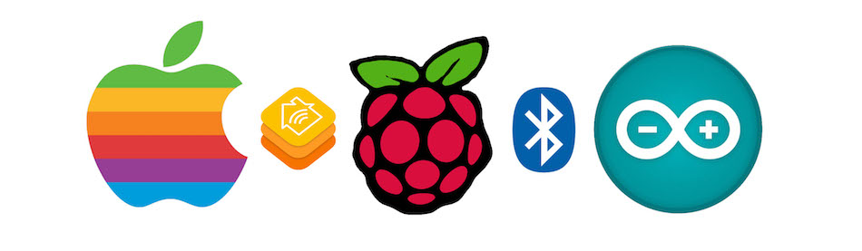

# homebridge-bluetooth


[](https://badge.fury.io/js/homebridge-bluetooth)

[Homebridge](https://github.com/nfarina/homebridge) plugin for exposing services and
characteristics of nearby [Bluetooth Low Energy](https://www.bluetooth.com/what-is-bluetooth-technology/bluetooth-technology-basics/low-energy) (BLE) peripherals as [HomeKit](https://www.apple.com/ios/home/) accesories. Ideal for wireless DIY home automation projects if you'd like to control them comfortably with Siri on any Apple device.



Homebridge runs on top of [Node.js](https://nodejs.org) server and is an open-source implementation of the Apple HomeKit protocol. HomeKit provides the API between your Apple device (i.e. Watch) and your home automation server (i.e. Raspberry Pi). This Homebridge [plugin](https://www.npmjs.com/package/homebridge-bluetooth) relays the communication from the home automation server to the BLE peripheral device (i.e. Arduino 101). Take a peek into the [examples](/examples/) folder for inspiration.


## Installation

Make sure your systems matches the [prerequisites](#what-are-the-prerequisites-for-installation). You need to have a C compiler, [Node.js](https://nodejs.org) server and if you're running on Linux the [`libbluez-dev`](http://www.bluez.org/download/) library.

### Install Homebridge & Noble
[Homebridge](https://github.com/nfarina/homebridge) is a lightweight framework built on top of [Node.js](https://nodejs.org/) server that provides the HomeKit bridge for your Apple devices to connect to. [Noble](https://github.com/sandeepmistry/noble) is BLE central module library for [Node.js](https://nodejs.org/) that abstracts away intricacies of each OS BLE stack implementation and provides a nice universal high-level API.

```sh
[sudo] npm install -g noble
[sudo] npm install -g --unsafe-perm homebridge node-gyp
[sudo] npm install -g homebridge-bluetooth
```

**Note** _Depending on your privileges `-g` flag may need root permissions to install to the global `npm` module directory._

### Configure Homebridge
Homebridge is setup via `config.json` file sitting in the `~/.homebridge/` directory. The [example config](config.json) included in the repository has lots of comments and is a good starting point. Each BLE peripheral device is uniquely identified by it's address. Services and characteristics are identified by UUID. Also, each of the [examples](/examples/) comes with it's own `config.json` file.

The easiest way to find the address of a BLE device is to start the plugin with a random/default address and then check the output for `Ignored | MyDevice - 01:23:45:67:89:ab` message. Alternatively you can run `[sudo] hcitool lescan` to discover available BLE devices.

Mapping of services and characteristics from Bluetooth to HomeKit relies on two things - matching read/write/nofity permissions and matching data type. To see what is available, take a look at the very long list [here](https://github.com/KhaosT/HAP-NodeJS/blob/master/lib/gen/HomeKitTypes.js). Services are towards the bottom of the file. Each characteristic has pre-defined permissions that represent the expected way to use it - i.e. it doesn't make sense to write (set) the current temperature. These permissions must match the corresponding permissions of the Bluetooth characteristic. All data are assumed to use little endian encoding for multi-byte values.

The following table summarizes permission matching for a very popular [BLEPeripheral](https://github.com/sandeepmistry/arduino-BLEPeripheral) library that can run on most Arduino boards:

| HomeKit `Characteristic.Perms[...]` | BLEPeripheral `BLECharacteristic(...)` |
| :---------------------------------- | :------------------------------------- |
| `READ`                              | `BLEWrite`                             |
| `WRITE`                             | `BLERead`                              |
| `NOTIFY`                            | `BLENotify`                            |

Similar to permissions, matching of the exchanged data type for [BLEPeripheral](https://github.com/sandeepmistry/arduino-BLEPeripheral) is summarized here:

| HomeKit `Characteristic.Formats[...]` | BLEPeripheral `BLETypedCharacteristic<...>` |
| :------------------------------------ | :------------------------------------------ |
| `BOOL`                                | `BLECharCharacteristic`                     |
| `INT`                                 | `BLEIntCharacteristic`                      |
| `FLOAT`                               | `BLEFloatCharacteristic`                    |
| `STRING`                              | `BLECharacteristic`                         |
| `UINT8`                               | `BLEUnsignedCharCharacteristic`             |
| `UINT16`                              | `BLEUnsignedShortCharacteristic`            |
| `UINT32`                              | `BLEUnsignedIntCharacteristic`              |
| `UINT64`                              | `BLEUnsignedLongCharacteristic`             |

For instance if you'd like create a HomeKit thermometer, you have to implement the `TemperatureSensor` service. According to the [list of available services and characteristics]() the service has one mandatory characteristic - `CurrentTemperature` and a handful of optional ones.

The `CurrentTemperature` characteristic communicates a `FLOAT` value and needs `READ` and `NOTIFY` permissions. Using the [BLEPeripheral](https://github.com/sandeepmistry/arduino-BLEPeripheral) library, the characteristic would be implemented as:

```cpp
BLEService temperatureSensorService("SERVICE-UUID-HERE");
BLEFloatCharacteristic currentTemperatureCharacteristic("CHARACTERISTIC-UUID-HERE", BLERead | BLENotify);
```

The corresponding entry in the `config.json` file that connects to the characteristic above is:

```js
"services" : [ {
    "name": "The Best HomeKit Thermometer",
    "type": "TemperatureSensor",
    "UUID": "SERVICE-UUID-HERE",
    "characteristics": [ {
        "type": "CurrentTemperature",
        "UUID": "CHARACTERISTIC-UUID-HERE"
    } ]
} ]
```

**Note** _All [UUIDs](https://en.wikipedia.org/wiki/Universally_unique_identifier) should be randomly generated to prevent collisions. [This page](https://www.uuidgenerator.net) is a good place to get your own._

### Run Homebridge
Depending on your privileges, accessing the BLE kernel subsystem may need root permissions.

```sh
[sudo] homebridge -D
```

**Note** _Running with `-D` turns on additional debugging output that is very helpful for getting addresses and UUIDs of your BLE devices that needs to match with the `config.json` file._

**Note** _See [this section of Noble readme](https://github.com/sandeepmistry/noble#running-without-rootsudo) for more details about running without `sudo`._


## Troubleshooting

If you encouter a different problem, please, open an [issue](https://github.com/vojtamolda/homebridge-bluetooth/issues).

### Home app can't discover any nearby accessories
Make sure the Apple device and the Homebridge server are on the same subnet and connected to the same wifi router.

Sometimes, homebridge server might think that, it has successfully paired with iOS, but iOS doesn't agree. Try to delete the `persist/` directory in the `~/.homebridge/` configuration folder. This removes all pairings that normally persist from session to session.

```sh
rm -rf ~/.homebridge/persist/
```

From time to time it looks like iOS ignores HomeKit bridges with `username` that it has already paired with. Try to change the `username` in the `bridge` section of `config.json` to a new value never used before.

```js
"username": "CC:22:3D:E3:CE:30"  ->  "username": "DD:33:4E:F4:DF:41"
```

### BLE peripheral is discovered, but immediately disconnects
This isssue seems to be happening on some versions of Raspbian running on the Pi 3. Resetting the BLE adapter seems to resolve the issue:

```sh
[sudo] hciconfig hci0 reset
```

Obviously, the solution is not really addressing the core of the problem, but it seems to help.


## FAQ

### Can I contribute my own example or a new feature?
Sure thing! All contributions are welcome. Just do a pull-request or open a new issue if you see something broken.


### Is this thing secure?
**No.** Not even close. Connection from your Apple device to Homebridge server is encrypted. However, all BLE communication is currently unencrypted and anyone with the right spoofing equipment can listen to it. Moreover, once the attacker has figured out what devices you have, he can also connect to any of your peripherals and control them directly. So don't use this if you're paranoid or if NSA is after you. You wouldn't sleep well.

[MFi](https://developer.apple.com/programs/mfi/) certified HomeKit BLE encryption uses quite-strong Ed25519 elliptic cypher. BLE has built-in support for encryption, but it seems that Apple has decided to build their own thing as usual. It makes some sense in this case since a lot is at stake - once HomeKit becomes widespread a security bug literally means open doors to your house. Hooray - let's connect billions of unsecured IoT devices to the internet! What could possibly go wrong??

Moreover, from bits and pieces available on the Internet, it seems that Apple has changed the specs several times and caused a lot of trouble for the manufacturers, since slower microprocessors tend to have a hard time doing all the involved encryption math. Initial pairing can take literally minutes. Pairing procedure uses SRP (Secure Remote Password (3072-bit) protocol with an 8-digit code (the number you have to type in when first pairing with Homebridge). After pairing, per session communication always uses unique keys derived by HKDF-SHA-512 and encrypted by the ChaCha20-Poly1305.

Theoretically, one should be able to get rid of the Homebridge 'middle-man' since HomeKit over BLE allows direct connection to any Apple device. While there are many good [HomeKit IP stacks around](https://github.com/KhaosT/HAP-NodeJS) BLE implementations are few and far between. There's only one implementation I'm aware of [here](https://github.com/aanon4/HomeKit), but it can't be easily ported to other boards.

BTW, I think it might be possible to re-write the BLE implementation above with [BLEPeripheral](https://github.com/sandeepmistry/arduino-BLEPeripheral) library instead of Nordic Semi's SoftDevice to make it run essentially everywhere. If anyone is interested in this project, please, let me know and maybe we can figure a plan and come up with something useful and fun to use.

Implementing a HomeKit over BLE stack correctly requires access to [MFi](https://developer.apple.com/programs/mfi/) internal documentation, which isn't publicly available, unless you're a registered developer at a company with big $$$. Making BLE accessories is simple, but making them secure seems to be very, very hard.


### What are the prerequisites for installation?

#### Linux (Debian Based, Kernel 3.6 or newer)
A supported  BLE (Bluetooth 4.0) USB dongle is required, if your device doesn't have it built-in.

 - Install [Node.js](https://nodejs.org/en/download/)

   [Node.js](https://nodejs.org) is an asynchronous event driven JavaScript server, ideal for building scalable, low-latency network applications. [Homebridge](https://www.npmjs.com/package/homebridge) is built on top of this server. It is being developed so quickly that package repositories of most distributions contain a very old version. Getting latest from the official website is recommended.

 - Install `libbluetooth-dev` and `libavahi-compat-libdnssd-dev`

   These libraries and their dependencies are required by [Noble](https://www.npmjs.com/package/noble) package and provide access to the kernel Bluetooth subsystem.

   ```sh
   sudo apt-get install bluetooth bluez libbluetooth-dev libudev-dev libavahi-compat-libdnssd-dev
   ```

#### macOS (10.10 or newer)
Check [this link](http://www.imore.com/how-tell-if-your-mac-has-bluetooth-40) to see if your mac has built-in BLE (Bluetooth 4.0) support. All macs from 2012 and newer are generally fine.

 - Install [Node.js](https://nodejs.org/en/download/)

   [Node.js](https://nodejs.org) is an asynchronous event driven JavaScript server, ideal for building scalable, low-latency network applications. [Homebridge](https://www.npmjs.com/package/homebridge) is built on top of this server. It is being developed so quickly that package repositories of most distributions contain a very old version. Getting latest from the official website is recommended.

 - Install [XCode](https://itunes.apple.com/ca/app/xcode/id497799835?mt=12)

   [XCode](https://developer.apple.com/xcode/) comes with a C compiler that is needed to compile the JavaScript to C bindings required by [Noble](https://www.npmjs.com/package/noble) package.

#### Windows (8.1 or newer)
Pull request is welcomed here... Both [Homebridge](https://www.npmjs.com/package/homebridge) and [Noble](https://www.npmjs.com/package/noble) should run on Windows, but I don't have a machine to test.


### On what devices was this plugin tested?
Here's a list of testing devices. The list is by no means exhaustive and the plugin will work with many more.
- Apple Device
  - [iPhone](https://en.wikipedia.org/wiki/IPhone) 5S & 6 running [iOS](https://en.wikipedia.org/wiki/IOS) 10

- Homebridge Server
  - [Raspberry Pi](https://en.wikipedia.org/wiki/Raspberry_Pi) 3 & 2 (with USB dongle) running [Raspbian](https://www.raspberrypi.org/downloads/raspbian/)  Jessie Lite
  - [Macbook Air](https://en.wikipedia.org/wiki/MacBook_Air) (2015) & [iMac](https://en.wikipedia.org/wiki/IMac) (2012) running [macOS](https://en.wikipedia.org/wiki/MacOS) 10.12

- Bluetooth Peripheral
  - nRF51 Based Boards
    - [Arduino 101](https://www.arduino.cc/en/Main/ArduinoBoard101), [RFDuino](http://www.rfduino.com/), [Bluefruit Micro](https://www.adafruit.com/product/2661)
  - nRF8001 Based Boards
    - [Arduino UNO](https://www.arduino.cc/en/Main/ArduinoBoardUno) + [nRF8001 Breakout](https://www.adafruit.com/products/1697),


## License

This work is licensed under the MIT license. See [license](license.txt) for more details.
